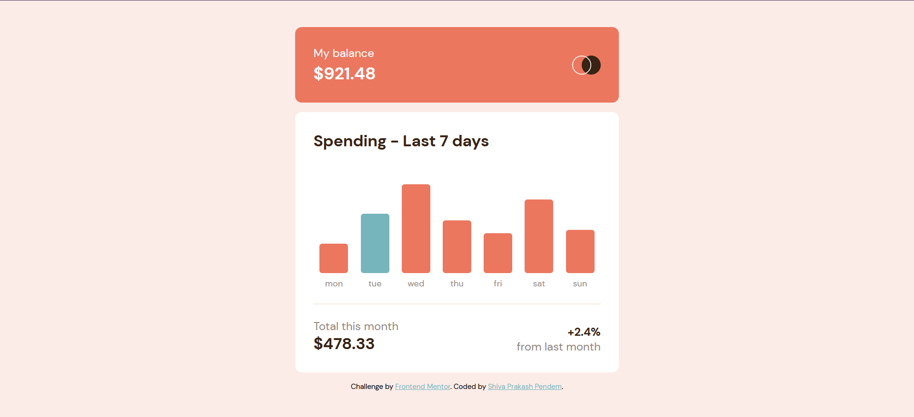
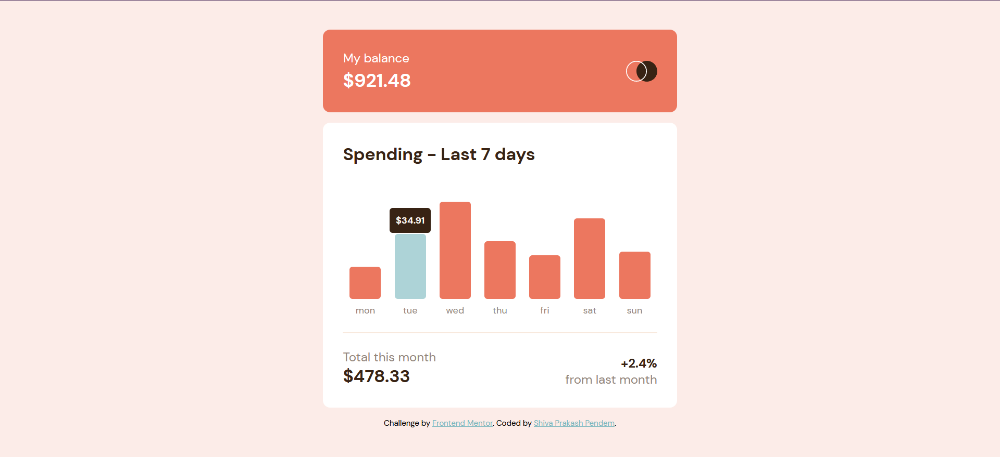
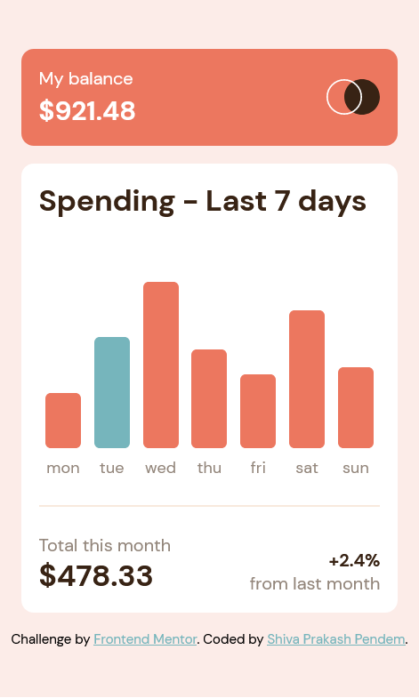

# Frontend Mentor - Expenses chart component solution

This is a solution to the [Expenses chart component challenge on Frontend Mentor](https://www.frontendmentor.io/challenges/expenses-chart-component-e7yJBUdjwt). Frontend Mentor challenges help you improve your coding skills by building realistic projects.

## Table of contents

- [Overview](#overview)
  - [The challenge](#the-challenge)
  - [Screenshots](#screenshots)
  - [Links](#links)
- [My process](#my-process)
  - [Built with](#built-with)
  - [What I learned](#what-i-learned)
  - [Continued development](#continued-development)
- [Author](#author)
- [Acknowledgments](#acknowledgments)

## Overview

### The challenge

Users should be able to:

- View the bar chart and hover over the individual bars to see the correct amounts for each day
- See the current day’s bar highlighted in a different colour to the other bars
- View the optimal layout for the content depending on their device’s screen size
- See hover states for all interactive elements on the page
- **Bonus**: Use the JSON data file provided to dynamically size the bars on the chart

### Screenshots

#### Desktop View

#### Hover View

#### Mobile View

### Links

- Solution URL: [GitHub repo](https://github.com/shivaprakash-sudo/expenses-chart-component)
- Live Site URL: [Expenses Chart Component](https://shivaprakash-sudo.github.io/expenses-chart-component/)

## My process

### Built with

- Semantic HTML5 markup
- CSS custom properties
- Flexbox
- Mobile-first workflow
- React - JS library
- TypeScript
- SCSS/SASS - CSS preprocessor

### What I learned

- Displaying dynamic chart data while type checking using TypeScript to ensure correct data is displayed.
- Using TypeScript with React.
- TypeScript is a pain in the a\*s, but worth it.

### Continued development

I would like to build more projects and learn more on using React with TypeScript.

## Author

- Frontend Mentor - [@shivaprakash-sudo](https://www.frontendmentor.io/profile/shivaprakash-sudo)

## Acknowledgments

I'd like to thank [Elaine](https://www.frontendmentor.io/profile/elaineleung) on frontendmentor for giving me ideas about dynamic data insertion, through her code.
